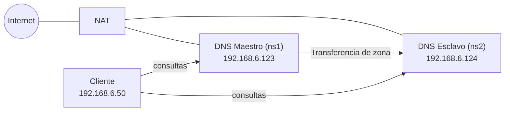

<div align="center">

# 🌐 Servidor DNS Maestro–Esclavo con BIND9

**Manual paso a paso para montar un DNS primario y uno secundario sobre Debian y VirtualBox**


</div>

---

## Índice

1. [Arquitectura](#arquitectura)
2. [Requisitos previos](#requisitos-previos)
3. [Fase 1: Preparar el clon (esclavo)](#fase-1-preparar-el-clon-esclavo)
4. [Fase 2: Configurar el maestro](#fase-2-configurar-el-maestro)
5. [Fase 3: Configurar el esclavo](#fase-3-configurar-el-esclavo)
6. [Fase 4: Pruebas y verificación](#fase-4-pruebas-y-verificación)
7. [Solución de problemas](#solución-de-problemas)
8. [Referencias](#referencias)

---

## Arquitectura

Dos servidores DNS con BIND9 en una red interna de VirtualBox. El **maestro** guarda las zonas originales y el **esclavo** las copia automáticamente mediante transferencia de zona. Cada servidor tiene además un adaptador NAT para salir a internet.



| Elemento | Valor |
|---|---|
| **Dominio** | `myguest.virtualbox.org` |
| **Red interna** | `192.168.6.0/24` |
| **Zona inversa** | `6.168.192.in-addr.arpa` |
| **Maestro (`ns1`)** | `192.168.6.123` · hostname `debiandragos` |
| **Esclavo (`ns2`)** | `192.168.6.124` · hostname `debiandragos-esclavo` |
| **Cliente de pruebas** | `192.168.6.50` |

---

## Requisitos previos

- Dos máquinas virtuales **Debian** con el paquete `bind9` instalado. El esclavo se obtiene **clonando** el maestro.
- Cada servidor con **dos adaptadores** en VirtualBox: Adaptador 1 en **NAT** y Adaptador 2 en **Red interna** (mismo nombre de red en las tres máquinas).
- Un cliente en la misma red interna para hacer las pruebas.

> [!IMPORTANT]
> Al clonar, VirtualBox puede copiar la misma MAC en la VM nueva. Hay que regenerarla (Paso 1) o habrá conflictos de red.

---

## Fase 1: Preparar el clon (esclavo)

### Paso 1. Cambiar las MACs

Con la VM esclava **apagada**:

1. Abre **VirtualBox** y selecciona la máquina esclava.
2. Ve a **Configuración → Red** y selecciona cada adaptador activo.
3. Despliega **Avanzadas** y pulsa el icono de **refrescar la MAC**.
4. Comprueba que está conectada a la misma **Red interna** que el maestro.

### Paso 2. Cambiar el hostname

Enciende la VM esclava y cambia el nombre:

```bash
sudo hostnamectl set-hostname debiandragos-esclavo
sudo nano /etc/hosts
```

Reemplaza el nombre antiguo por `debiandragos-esclavo`.

> [!NOTE]
> Usa guion normal (`-`) y no guion bajo (`_`). Los hostnames no admiten guiones bajos.

**Verificación:**

```bash
hostname
# debiandragos-esclavo
```

### Paso 3. Configurar la IP estática interna

Identifica el nombre del adaptador interno:

```bash
ip a
```

Edita la configuración de red:

```bash
sudo nano /etc/network/interfaces
```

```text
auto enp0s8
iface enp0s8 inet static
    address 192.168.6.124
    netmask 255.255.255.0
```

> [!TIP]
> No añadas `gateway` en el adaptador interno. La salida a internet ya la da el adaptador NAT y dos rutas por defecto entrarían en conflicto.

Aplica los cambios:

```bash
sudo systemctl restart networking
```

**Verificación:**

```bash
ping 192.168.6.123
```

Debe haber respuesta continua.

---

## Fase 2: Configurar el maestro

Trabaja en la máquina `192.168.6.123`.

### Paso 4. Crear el directorio de zonas y la zona directa

```bash
sudo mkdir -p /etc/bind/zones
sudo chown bind:bind /etc/bind/zones
sudo nano /etc/bind/zones/db.myguest.virtualbox.org
```

```dns
$TTL    604800
@       IN      SOA     ns1.myguest.virtualbox.org. admin.myguest.virtualbox.org. (
                          2023100601        ; Serial
                              604800        ; Refresh
                               86400        ; Retry
                             2419200        ; Expire
                              604800 )      ; Negative Cache TTL
;
; Servidores de nombres (NS)
@       IN      NS      ns1.myguest.virtualbox.org.
@       IN      NS      ns2.myguest.virtualbox.org.

; Direcciones IP de los servidores de nombres (A)
ns1     IN      A       192.168.6.123
ns2     IN      A       192.168.6.124

; Registros A para la red
@       IN      A       192.168.6.123
maestro IN      A       192.168.6.123
esclavo IN      A       192.168.6.124
cliente IN      A       192.168.6.50
```

### Paso 5. Crear la zona inversa

```bash
sudo nano /etc/bind/zones/db.6.168.192
```

```dns
$TTL    604800
@       IN      SOA     ns1.myguest.virtualbox.org. admin.myguest.virtualbox.org. (
                          2023100601        ; Serial
                              604800        ; Refresh
                               86400        ; Retry
                             2419200        ; Expire
                              604800 )      ; Negative Cache TTL
;
@       IN      NS      ns1.myguest.virtualbox.org.
@       IN      NS      ns2.myguest.virtualbox.org.

; Registros PTR
123     IN      PTR     ns1.myguest.virtualbox.org.
124     IN      PTR     ns2.myguest.virtualbox.org.
50      IN      PTR     cliente.myguest.virtualbox.org.
```

### Paso 6. Declarar las zonas y autorizar la transferencia

```bash
sudo nano /etc/bind/named.conf.local
```

```text
zone "myguest.virtualbox.org" {
    type master;
    file "/etc/bind/zones/db.myguest.virtualbox.org";
    allow-transfer { 192.168.6.124; };
    also-notify { 192.168.6.124; };
};

zone "6.168.192.in-addr.arpa" {
    type master;
    file "/etc/bind/zones/db.6.168.192";
    allow-transfer { 192.168.6.124; };
    also-notify { 192.168.6.124; };
};
```

| Directiva | Función |
|---|---|
| `allow-transfer` | Solo el esclavo puede pedir una copia de la zona |
| `also-notify` | El maestro avisa al esclavo cuando la zona cambia |

### Paso 7. Validar y reiniciar

```bash
sudo named-checkconf
sudo named-checkzone myguest.virtualbox.org /etc/bind/zones/db.myguest.virtualbox.org
sudo named-checkzone 6.168.192.in-addr.arpa /etc/bind/zones/db.6.168.192
```

Los tres comandos deben terminar sin errores y los `named-checkzone` deben responder **`OK`**.

```bash
sudo systemctl restart bind9
```

---

## Fase 3: Configurar el esclavo

Trabaja en la máquina `192.168.6.124`.

### Paso 8. Limpiar lo heredado del clon

Al ser un clon, el esclavo trae las zonas del maestro. Hay que eliminarlas.

```bash
sudo nano /etc/bind/named.conf.local
```

Borra todas las zonas `type master` que aparezcan. Después elimina los ficheros de zona copiados y crea el directorio de las zonas esclavas:

```bash
sudo rm -rf /etc/bind/zones
sudo mkdir -p /var/cache/bind/slaves
sudo chown bind:bind /var/cache/bind/slaves
```

> [!WARNING]
> El esclavo debe guardar sus zonas en `/var/cache/bind/`. En Debian, AppArmor solo permite escribir ahí al usuario `bind`. Si usas otra ruta, la transferencia fallará con `permission denied`.

### Paso 9. Declarar las zonas esclavas

```bash
sudo nano /etc/bind/named.conf.local
```

```text
zone "myguest.virtualbox.org" {
    type slave;
    masters { 192.168.6.123; };
    file "/var/cache/bind/slaves/db.myguest.virtualbox.org";
};

zone "6.168.192.in-addr.arpa" {
    type slave;
    masters { 192.168.6.123; };
    file "/var/cache/bind/slaves/db.6.168.192";
};
```

### Paso 10. Ajustar las opciones globales

```bash
sudo nano /etc/bind/named.conf.options
```

```text
options {
    directory "/var/cache/bind";
    allow-query { 127.0.0.1; 192.168.6.0/24; };
    recursion yes;
    dnssec-validation no;
    forwarders { 1.1.1.1; 8.8.8.8; };
};
```

### Paso 11. Verificar y reiniciar

```bash
sudo named-checkconf
sudo systemctl restart bind9
ls -l /var/cache/bind/slaves/
```

Deben aparecer los ficheros `db.myguest.virtualbox.org` y `db.6.168.192`. Si no aparecen al instante, fuerza la transferencia:

```bash
sudo rndc retransfer myguest.virtualbox.org
```

---

## Fase 4: Pruebas y verificación

### Paso 12. Configurar el cliente

En el cliente (`192.168.6.50`):

```bash
sudo nano /etc/resolv.conf
```

```text
nameserver 192.168.6.123
nameserver 192.168.6.124
search myguest.virtualbox.org
```

### Paso 13. Comparar la respuesta de ambos servidores

```bash
dig @192.168.6.123 myguest.virtualbox.org SOA
dig @192.168.6.124 myguest.virtualbox.org SOA
```

Ambos deben devolver el **mismo serial** y la flag **`aa`** (*authoritative answer*).

### Paso 14. Prueba de replicación

1. En el **maestro**, añade un registro de prueba a `/etc/bind/zones/db.myguest.virtualbox.org`:

   ```dns
   prueba    IN    A    192.168.6.99
   ```

2. **Incrementa el serial** (por ejemplo, de `2023100601` a `2023100602`).

3. Recarga la zona:

   ```bash
   sudo rndc reload
   ```

4. Si el esclavo no se actualiza solo, fuerza la transferencia en el **esclavo**:

   ```bash
   sudo rndc retransfer myguest.virtualbox.org
   ```

5. Desde el **cliente**, pregunta directamente al esclavo:

   ```bash
   dig @192.168.6.124 prueba.myguest.virtualbox.org
   ```

El esclavo debe responder `192.168.6.99`. Cuando termines, elimina la línea de prueba en el maestro y **vuelve a subir el serial**.

> [!IMPORTANT]
> Si no subes el serial, el esclavo no detecta cambios y no se actualiza. Es la causa más habitual de que "el esclavo no copia".

### Paso 15. Prueba de alta disponibilidad

1. Detén BIND en el **maestro**:

   ```bash
   sudo systemctl stop bind9
   ```

2. Desde el **cliente**, consulta de nuevo:

   ```bash
   dig @192.168.6.124 esclavo.myguest.virtualbox.org
   ```

3. El esclavo debe resolver la petición por sí solo.

4. Vuelve a arrancar el maestro:

   ```bash
   sudo systemctl start bind9
   ```

---

## Solución de problemas

| Síntoma | Causa probable | Solución |
|---|---|---|
| No aparecen ficheros en `/var/cache/bind/slaves/` | El maestro no autoriza la transferencia o el puerto 53 está bloqueado | Revisa `allow-transfer` en el maestro y que el puerto 53 **TCP y UDP** esté abierto |
| `permission denied` en el log del esclavo | El fichero de zona está fuera de `/var/cache/bind/` o el directorio no es de `bind` | `sudo chown bind:bind /var/cache/bind/slaves` y usa esa ruta |
| El esclavo responde con datos antiguos | No se subió el serial en el maestro | Incrementa el serial y ejecuta `sudo rndc retransfer <zona>` en el esclavo |
| `bad owner name (check-names)` | Un nombre de host tiene guion bajo `_` | Usa guion normal `-` en los registros |
| `ping` al maestro falla | Las VMs no comparten el mismo nombre de red interna | Revisa la configuración de red en VirtualBox |
| Dos máquinas con la misma IP o conflictos | MAC duplicada tras clonar | Regenera la MAC (Paso 1) |

**Comandos útiles de diagnóstico:**

```bash
sudo journalctl -u named --no-pager | tail -30   # últimos mensajes de BIND
sudo named-checkconf                              # sintaxis de la configuración
sudo rndc retransfer myguest.virtualbox.org       # forzar transferencia de zona
dig @192.168.6.124 myguest.virtualbox.org SOA     # comparar serial
```

---

## Referencias

- [Documentación oficial de BIND 9](https://bind9.readthedocs.io/)
- [BIND9 en la Debian Wiki](https://wiki.debian.org/Bind9)
- [Instalación y configuración de BIND9 en Debian (zeppelinux.es)](https://www.zeppelinux.es/instalacion-y-configuracion-de-bind9-en-debian/)
- [DNS esclavo con BIND9 (javiercd.es)](https://www.javiercd.es/posts/servicios/dns/bind9/dns_esclavo/dns_esclavo/)
