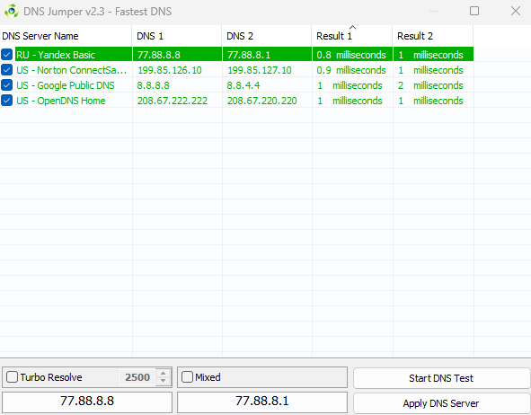
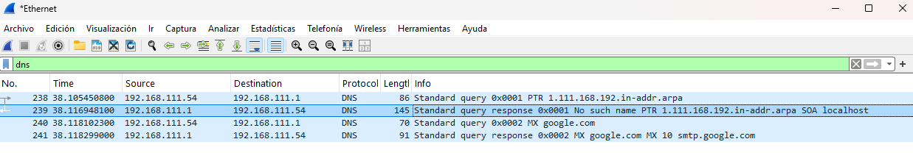

# Práctica: Análisis y Resolución del Sistema DNS

* **Módulo:** 0375 Servicios de red  
* **Ciclo Formativo:** ASIX  
* **Alumno:** Dragos Mihail Batin 
* **Formato de Entrega:** URL al informe documentado en GitBook / GitHub  


## 1. El ecosistema DNS (OSINT y Web)

### 1.1. Investigación de Jerarquía
* **¿Qué organismo internacional coordina y asigna los parámetros a nivel global del sistema de nombres de dominio e IPs?**
  * Icann, Internet Corporation for Assigned Names and Numbers 

* **¿Qué empresa u organismo gestiona (Registry) cada uno de los siguientes dominios de nivel superior (TLD)?**
  * `.es`: lo controla Red.es, que es del Ministerio para la Transformación Digital y de la Función Pública de España
  * `.cat`: lo gestiona Accent Obert 
  * `.edu`: lo gestiona Educause
  * `.ifp.es`: el .es lo gestiona Red.es y el .ifp lo gestiona ifp propiamente.


### 1.2. Herramientas OSINT (Whois y DNS Lookup)
* **¿Qué información te brinda una consulta Whois sobre un dominio?**
  * Te proporciona como una ficha de ese dominio, como el nombre, la fecha del registro...

* **Define brevemente la diferencia entre el Registry de la base de datos y el Registrar (Registrador) del dominio.**
  * El Registry es la empresa que mantiene la base de datos con los dominios, y el Registrar es la empresa que permite al uso del dominio, que los usuarios puedan entrar. 

* **Investiga: ¿Qué es DNSSEC y qué problema de seguridad intenta resolver en las resoluciones DNS?**
  * DNSSEC (Domain Name System Security Extensions), es una firma digital que nos asegura de que entramos a la web correcta. 


### 1.3. Rendimiento DNS (GRC DNS Benchmark)
1. Descarga e inicia la aplicación **GRC DNS Benchmark**.
2. Ejecuta el test para comprobar cuáles son los servidores DNS más rápidos desde tu ubicación.
3. Selecciona los **3 servidores más rápidos** de la lista, anota sus IPs y argumenta brevemente de qué empresas son:

   



## 2. Configuración y Caché

### 2.1. Cambio de servidores DNS
* **¿Cómo puedes ver mediante consola (CLI) qué servidores DNS tienes asignados actualmente en Windows y en Linux?**
  * **Windows:**
    ```bash
    ipconfig /all
    ```
  * **Linux:**
    ```bash
    cat /etc/resolv.conf
    ```

* **Cambia la configuración de red de tu equipo principal (Windows o Linux) poniendo como DNS primario y secundario los que obtuviste en el Benchmark. Muestra captura del cambio:**
  

* **¿En qué menú de tu dispositivo móvil (Android/iOS) podrías forzar el uso de unos DNS específicos para tu conexión Wi-Fi?**
  > 


### 2.2. Gestión de la caché DNS
* **Muestra una captura de pantalla de algunas direcciones almacenadas en la caché de tu equipo (`ipconfig /displaydns` en Windows o `resolvectl statistics` en Linux):**
 

* **Vacía la caché de tu equipo (`ipconfig /flushdns` o `resolvectl flush-caches`). Explica para qué es útil esta acción en el día a día de un administrador de sistemas:**
 * Esto permite eliminar resoluciones almacenadas del equipo. Esta acción puede ser útil cuando un dominio ha cambiado de dirección IP, existen entradas DNS incorrectas o se producen problemas de resolución. Al vaciar la caché, las siguientes consultas deberán obtener nuevamente la información DNS, siempre que no exista otra caché intermedia.


## 3. Administración - Troubleshooting con DIG y CLI

### 3.1. Consultas específicas de registros (`dig`)
> Documenta con capturas de pantalla y explica el resultado de ejecutar las siguientes consultas sobre el dominio `aliexpress.com` (u otro de tu elección):

* **A (`dig aliexpress.com`):**


  * *Análisis de la sección ANSWER SECTION:*
    > 

* **Short (`dig +short aliexpress.com`):**

  * *¿Por qué es útil este formato en scripts de Bash?*
    > 

* **MX (`dig MX aliexpress.com`):**

  * *Identifica el campo de Prioridad/Preference de los servidores de correo:*
    > 

* **NS (`dig NS aliexpress.com`):**

  * *¿Cuáles son los servidores que tienen la autoridad sobre las zonas de este dominio?*
    > 


### 3.2. Autoridad y Caché (TTL)
* **¿Qué diferencia existe entre un registro SOA (Start of Authority) y un registro NS (Name Server)?**
  > 

* **Realiza una consulta a un dominio cualquiera. Observa el valor TTL (Time To Live). Vuelve a realizar la consulta a los 5 segundos:**
  * *Resultado del TTL inicial:* 
  * *Resultado del TTL tras 5 segundos:* 
  * *¿Qué ha pasado con el valor numérico del TTL? ¿Qué nos demuestra esto sobre el origen de la respuesta (Caché vs Servidor Autoritativo)?*
    > 


### 3.3. Trazabilidad Completa (`+trace`)
* **Ejecuta el comando `dig +trace aliexpress.com`:**


* **Explica paso a paso cómo tu ordenador contacta primero con los Root Servers (`.`), luego con los servidores del TLD (`.com`) y finalmente con los servidores autoritativos del dominio:**
  1. **Root Servers (`.`):** 
  2. **TLD Servers (`.com`):** 
  3. **Servidores Autoritativos:** 


## 4. Análisis de Tráfico de Red (Wireshark)

### 4.1. Captura de paquetes
> Realiza una captura en Wireshark filtrando por `dns` o `udp.port == 53` mientras ejecutas una consulta como `nslookup -type=mx google.com`.

* **Captura del intercambio Petición/Respuesta en Wireshark:**
  


### 4.2. Análisis detallado
* **Capa de Transporte:**
  * *¿Qué protocolo se utiliza (TCP o UDP)? Utiliza el UDP *
  * *¿Por qué DNS utiliza este protocolo por defecto en lugar del otro?*
    * DNS utiliza UDP por defecto porque las consultas DNS suelen ser pequeñas y permite realizar comunicaciones sin establecer una conexión previa. 

* **Puertos:**
  * *Puerto de origen (cliente): 63410. 
  * *Puerto de destino (servidor): 53.

* **Identificador (Transaction ID):**
* 0x0001

  * *¿Qué identificador de transacción vincula la respuesta del servidor con la petición de tu cliente?*
* 0x0002

* **Flags:**

  * *¿La opción Authoritative Answer está a 0 o a 1? ¿Qué significa esto?*
   * 0, la respuesta no viene de un servidor autoritario.

* **Respuestas (Answers):**

  * *¿Qué servidor de correo de Google tiene la prioridad (preference) más alta (el número más bajo)?*
       * smtp.google.com 
