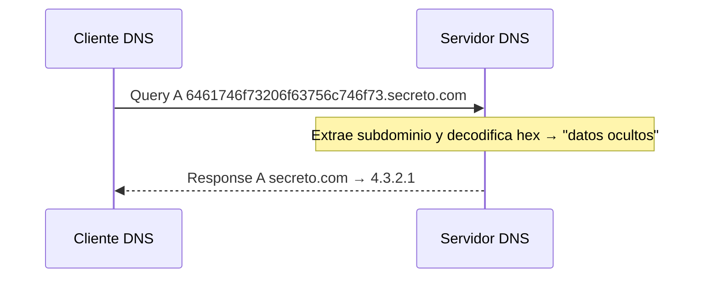
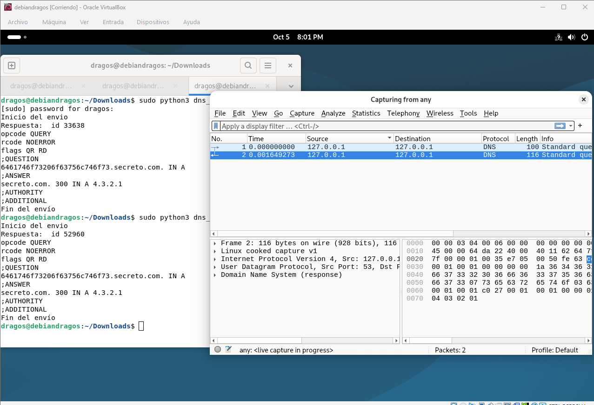

# Seguridad en el DNS (ACT1)

**Módulo:** 037 Seguridad en servicios · **Ciclo:** ASIX
**Entrega:** URL a un informe documentado en GitBook personal

---

## 1. Objetivo

Analizar e implementar la seguridad en el servicio DNS mediante un **canal encubierto (DNS covert channel)**: se ocultan datos dentro del nombre de un subdominio.

## 2. Qué hay que hacer

- Ejecutar los scripts de Python, analizar lo que hacen y **capturar el tráfico con Wireshark**.
- Las pruebas de ejemplo se hicieron en una sola máquina (localhost), pero hay que **repetirlas en dos VM distintas** (o host + VM), con **dos IPs diferentes**, mostrándolo tanto en el funcionamiento como en las capturas.

## 3. Los dos scripts

| | Servidor (`dns_server_1_peticion.py`) | Cliente (`dns_client_1_peticion.py`) |
|---|---|---|
| Función | Espera **1 solo paquete** DNS (se puede modificar para que escuche indefinidamente) | Envía una *query* de registro **A** y espera la respuesta |
| Lógica clave | Extrae el subdominio, convierte el **hexadecimal a texto** y responde con un registro A | El subdominio **son los datos ocultos en hexadecimal** |
| Nota | En Linux debe ejecutarse **como administrador** (puerto 53) | Finaliza al recibir la respuesta |

## 4. Cómo funciona el canal oculto

1. Texto original: `datos ocultos`
2. Conversión a hexadecimal: `6461746f73206f63756c746f73`
   - `64 61 74 6f 73` → "datos"
   - `20` → espacio
   - `6f 63 75 6c 74 6f 73` → "ocultos"
3. El hex se usa como subdominio: `6461746f73206f63756c746f73.secreto.com`
4. El cliente consulta ese nombre (tipo A, clase IN). El servidor lo recibe, elimina `.secreto.com`, decodifica el hex y recupera el mensaje.
5. El servidor responde con un registro A cualquiera: `secreto.com. 300 IN A 4.3.2.1` (TTL 300 s). La respuesta solo confirma; **la información viaja en la pregunta**.

Para un observador, parece una consulta DNS normal, y por eso es una técnica de exfiltración de datos.

## 5. Capturas del documento original

### Consolas

- **Servidor:** "Esperando 1 petición DNS…", `id 3934`, `opcode QUERY`, `rcode NOERROR`, flags `RD`. Muestra el nombre completo, el subdominio recibido y **"Mensaje oculto recibido: datos ocultos"**.
- **Cliente:** "Inicio del envío", respuesta con flags `QR RD`, mismo `id 3934`, sección ANSWER con `4.3.2.1` y "Fin del envío".

### Wireshark: trama 39 (query)

- 127.0.0.1 → 127.0.0.1, UDP, puerto origen 55467 → destino **53**, 98 bytes.
- Transaction ID `0xfeca`, flags `0x0100` (consulta estándar, recursión deseada).
- Questions 1; Answer, Authority y Additional RRs a 0.
- Name: subdominio hex, **Name Length 38**, **Label Count 3** (hex + secreto + com), Type A, Class IN.
- En el volcado hexadecimal se ve resaltado el subdominio.

### Wireshark: trama 40 (respuesta)

- Puertos invertidos (53 → 55467), 114 bytes.
- Mismo ID `0xfeca`, flags `0x8100` (respuesta, sin error). Answer RRs 1.
- Answers: `secreto.com: type A, class IN, addr 4.3.2.1`.
- Tiempo de respuesta: 0,0017 s. Wireshark enlaza ambas tramas con `[Response In]` / `[Request In]`.

## 6. Mi captura (Debian en VirtualBox)

- Ejecución con `sudo python3` dos veces: mismo subdominio hex hacia `secreto.com`, respuesta `NOERROR` y registro `4.3.2.1`.
- Los IDs de transacción cambian en cada ejecución (`33638` y `52960`), mientras que en el documento era `3934`.
- Wireshark captura en la interfaz **any** (live capture): 2 paquetes, query (100 bytes) y respuesta (116 bytes), ambos **127.0.0.1 → 127.0.0.1**.
- Las longitudes son 2 bytes mayores que en el original (98/114) porque la interfaz `any` usa *Linux cooked capture v1* en lugar de Ethernet II.
- En el volcado hex de la respuesta aparece `04 03 02 01` al final (la IP 4.3.2.1).

